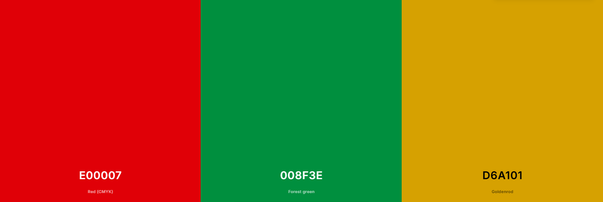
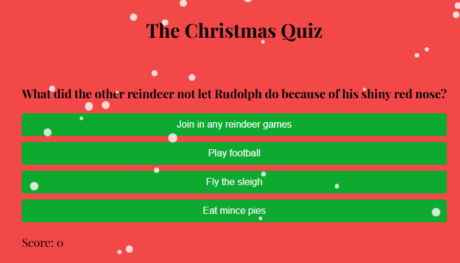
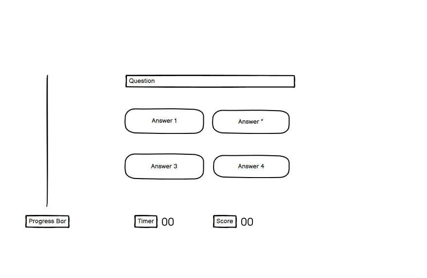
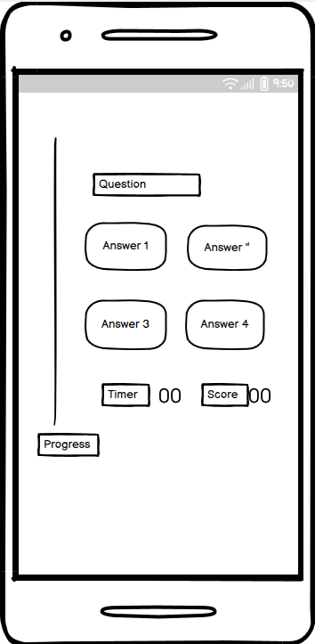
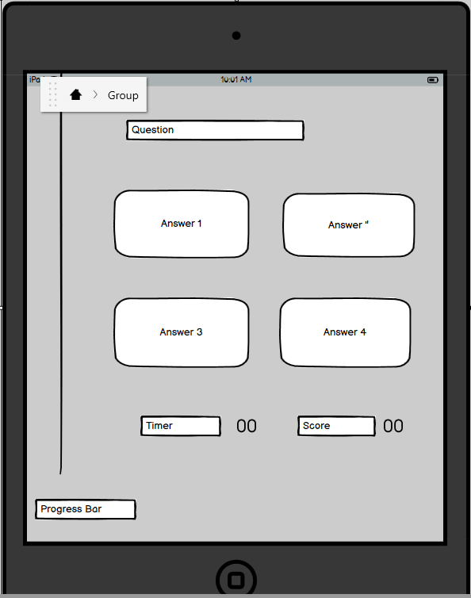
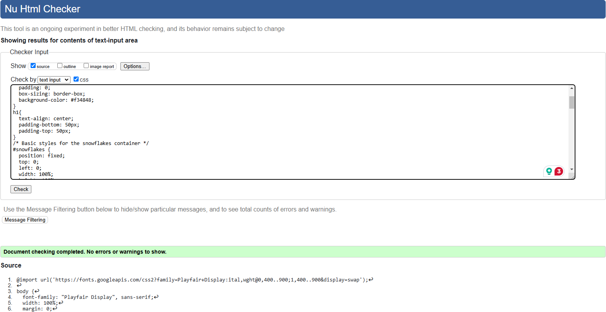

# The_Christmas_Quiz

## Description

The Christmas Quiz Game is a fun, festive trivia experience that tests your Christmas knowledge. Players can enjoy Christmas-themed questions.

Each correct answer earns points and triggers fun animations from a festive mascot, while friendly feedback encourages players to keep going. 
The game features a scoreboard and a celebratory ending with snowfall and music.

Perfect for playing on your own or playing with friends, this game is a nice way to celebrate Christmas!

## User Experience (UX)

### User stories

User Story for a Christmas Quiz Game
A Christmas Quiz: 

This quiz is for users who love Christmas and enjoy trivia games.

I want to create a fun and engaging Christmas-themed quiz that tests my holiday knowledge while giving me a good festive experience.

you can Learn interesting facts, challenge yourself, and share the joy of Christmas with friends and family.

#### First Time Visitor Goals

To explore the Game.

1. Understand the concept and rules of the Christmas Quiz Game.

2. Get a feel for the festive theme and user-friendly design.

3. Start the game and answer up to 10 questions to experience the full game.

4. See the interactive elements like the score mascot animation moving up the board.

5. Appreciate the festive theme and Christmas questions.

6. Learn about multiplayer options or share results with friends and family.

6. Complete the questions or a full round and enjoy the celebratory experience.

#### Returning Visitor Goals

1. Aim to beat their previous high score or achieve a perfect game.

2. Share results and invite others to play.

#### Frequent User Goals

1. Complete all categories and achieve the highest possible score.
2. Challenge themselves with time limits.
3. Use the game as one of their new holiday traditions.

### Design

The design features a red background with a festive touch of falling snowflakes. The buttons are green colour, with a gold hover effect, 
providing an elegant contrast against the red background and adding a holiday feel to the quiz page.

#### Logo
The logo was designed and downloaded from [Design.com](https://www.design.com/)


#### Colour Scheme
The colour scheme for the quiz page is festive and colourful. The primary background is a rich red, which creates a warm and welcoming environment. 
The buttons are a vibrant, refreshing green that stands out against the red background. 
When users hover over the buttons, they change to gold, providing an air of beauty and warmth. 
The use of red, green, and gold suggests a Christmas or winter motif, making the design visually appealing and seasonal.



#### Typography
The typography enhances the festive design by being clear, bold, and modern. The quiz questions are written in an effective and easy-to-read font, 
such as Playfair Display or sans-serif, which makes them stand out on the page. The button language is straightforward and clear, so it's readable and complements the modern design.  
The text colours are largely black and white to contrast with the red background, with some tweaks to match the green and gold button styles.
All fonts were sourced through [Google Fonts](https://fonts.google.com/)
The font that I've selected for my website is simple, modern, and extremely readable; it's meant to communicate both professionalism and warmth. 
The headlines' bold, Playfair Display font draws attention without being unduly harsh, and nicely balanced. 



#### Layout

The quiz page's layout is simple and practical, intended to keep the user focused on the quiz information while retaining a festive theme:

1. The background: The entire page has a red backdrop with animated falling snowflakes, which creates a lively and appealing mood.
2. Question Section: The question is prominently displayed at the top centre of the page under the heading in a bold font making it the design's focus point.
3. The answer buttons appear beneath the question in a grid or single-column arrangement, depending on the screen size.
4. The buttons are evenly placed for clarity, with a bright green colour and a gold hover effect to emphasise interactivity.
   Responsive Design: The layout adapts to various screen sizes, making the quiz accessible on desktop, mobile and iPad devices.
   Elements modify spacing and position to ensure a clean appearance on smaller displays.
   
This layout is striking with a mix of utility and the festive theme, making the quiz visually appealing and easy to browse.

#### Imagery
The imagery on the quiz page contributes to its festive and entertaining theme:
Animated snowflakes gently fall across the screen, giving movement and a wintery atmosphere. The snowflakes are delicate and not distracting, 
creating a dynamic background without overpowering the content.
The bright red background shows warmth and festivity, making it the ideal canvas for the interactive features and adding to the festive mood.
Green buttons with a gold hover effect offer contrast while also creating a sense of interactivity, directing the user's attention to the quiz answers.
Overall, the picture uses movement (snowflakes), vivid colours, and modest decorative elements to create a welcoming and joyous mood.


### Wireframes

The wireframes I’ve created for my website serve as a visual reference for planning and organizing the overall layout of the site. 
The wireframes allow me to map out the layout of each page, focusing on how visitors will navigate and interact with the content.

Desktop Wireframe - [View](https://wireframepro.mockflow.com/editor.jsp?editor=off&perm=Owner&projectid=M74L8w1RTh&publicid=f6317e4769e440d18a553e8f44d7a54c&space=ce16c8809ceb42f3af9a9e5154b3aabd#/page/c9ec330abf5a472ba4b1836009c9b01c/mode/design)



Mobile Wireframe - [View](https://wireframepro.mockflow.com/editor.jsp?editor=off&perm=Owner&projectid=M74L8w1RTh&publicid=f6317e4769e440d18a553e8f44d7a54c&space=ce16c8809ceb42f3af9a9e5154b3aabd#/page/De59d1a70e49d2a039f450db264f64023/mode/design)



Tablet and iPad Wireframe - [View](https://wireframepro.mockflow.com/editor.jsp?editor=off&perm=Owner&projectid=M74L8w1RTh&publicid=f6317e4769e440d18a553e8f44d7a54c&space=ce16c8809ceb42f3af9a9e5154b3aabd#/page/Db889ae22799549a29dbf8a6036ac84fb/mode/design)



## Features

### Navigation Bar
The navigation bar (navbar) on my website is designed to be simple, intuitive, and accessible, ensuring visitors can easily find their way around. 
Positioned at the top of each page, it remains visible as users scroll allowing for quick navigation.
The navbar features clean, easy-to-read text in a font that matches the overall style of the website.
The layout is horizontal, with each item evenly spaced for a tidy, organized look.
Each menu item is clearly labeled, guiding visitors to key sections like "Home," "About," "Learn More," and "Contact page." 
The number of links is kept minimal to avoid overwhelming users, focusing on the most important areas they’ll want to explore.


When the navigation bar is on a smaller device the navbar collapses into a hamburger menu, 
keeping the design sleek and ensuring a smooth browsing experience across all devices.


### Hero Image
My website's hero image is a striking and attractive image that grabs users' attention right away. 
It takes up the entire width of the screen, making a powerful first impression and establishing the overall tone of the website.
The graphic captures the spirit of my brand, which is warm and inviting. 
The hero image provides a clear picture of the talent and passion that go into the work.


### About Page
My website's "About" page aims to provide users with an interesting and brief overview of my site and the values of my business. 
With a well-balanced combination of text and colours, the layout is clear and eye-catching, and the information is made to feel both friendly and educational.


### Learn More Page
My website's "Learn More" page aims at offering visitors a detailed look at my crocheting methods, techniques, and the background behind my art. 
It serves as a hub for information where I share the enthusiasm, knowledge, and ideas that motivate my work. 
To keep visitors interested, the website layout is clear and simple to use, creating a balance between interesting text and colours.


### Contact Page
My website's "Contact" page is simple to use and intuitive, making it simple for visitors to get in touch with me. 
It has a friendly tone and a simple design that highlights the important details.
The page includes a simple contact form where users can fill out their name, email address, and message. 
Each field is clearly labeled, ensuring that visitors understand what information is required.


When the user submits the form there are re-directe to the thank you page.
### Thank You Page
The "Thank You" page on my website serves as a warm and friendly confirmation for visitors who have completed an action, such as submitting a contact form. 
It’s designed to express gratitude and provide a positive user experience while guiding them on what to expect next.


### Footer
The purpose of my website's footer is to give users quick access to important information while keeping a tidy, 
well-coordinated appearance that blends in with the overall theme. Consistent access to the navigation bar and links is ensured by its placement at the bottom of the page.


### Call to action Buttons
My website's call-to-action buttons are purposefully made to draw users in and promote interaction. 
To make each button stand out on the website, they are all designed with aesthetically pleasing designs and clear messaging.


### Back to Top Button
The "Back to Top" button is activated when you ether click on a link to move to another part of the website or when you start to scroll down the page.
The "Back to Top" button on my website is a convenient feature designed to enhance user experience by allowing visitors to quickly return to the top of the page with a single click.


## Technologies Used

### Languages Used

[HTML5](https://en.wikipedia.org/wiki/HTML5)

[CSS3](https://en.wikipedia.org/wiki/Cascading_Style_Sheets)

### Frameworks, Libraries & Programs Used

1. [Bootstrap 4.4.1:](https://getbootstrap.com/docs/4.4/getting-started/introduction/)
    - Bootstrap was used to assist with the responsiveness and styling of the website.
1. [Hover.css:](https://ianlunn.github.io/Hover/)
    - Hover.css was used on the Social Media icons in the footer to add the float transition while being hovered over.
1. [Google Fonts:](https://fonts.google.com/)
    - Google fonts were used to import the 'Titillium Web' font into the style.css file which is used on all pages throughout the project.
1. [Font Awesome:](https://fontawesome.com/)
    - Font Awesome was used on all pages throughout the website to add icons for aesthetic and UX purposes.
1. [jQuery:](https://jquery.com/)
    - jQuery came with Bootstrap to make the navbar responsive but was also used for the smooth scroll function in JavaScript.
1. [Git](https://git-scm.com/)
    - Git was used for version control by utilizing the Gitpod terminal to commit to Git and Push to GitHub.
1. [GitHub:](https://github.com/)
    - GitHub is used to store the projects code after being pushed from Git.
1. [mockflow:](https://mockflow.com/)
    - mockflow was used to create the [wireframes](https://github.com/) during the design process.

## Testing

The website is responsive on all device sizes.
### Desktop


### Mobile


The W3C Markup Validator and W3C CSS Validator Services were used to validate every page of the project to ensure there were no syntax errors in the project.

[W3C Markup Validator](https://jigsaw.w3.org/css-validator/#validate_by_input)


[W3C CSS Validator](https://jigsaw.w3.org/css-validator/#validate_by_input)


### Testing User Stories from User Experience (UX) Section
    
#### First Time Visitor Goals

As a First Time Visitor, I want them to easily understand the main purpose of the site and learn more about the organisation.

1. When entering the site, users are greeted with a clean and easy to read navigation bar to go to the page of their choice.
Under the navigation bar there is a background image, text a "ask a question" and "Learn More" call to action button.
2. The main points are made immediately with the background image
3. To find out more about the organisation, the user has two options: either scroll down or click the call to action buttons,
which will take them to the same location.

As a First Time Visitor, I want to be able to easily be able to navigate throughout the site to find content.

1. The navigation bar is clear labled so the user knows which part of the page they will be taken to.
2. Tere is a "Back nto Top " call for action button that appears when you ether scroll or click a navigation button
that will return the user back to the top of the page.
3. On the Contact Me Page, when the user has filled in the require text areas and click on the submit button
it will take them to a page that says "Thank you your question will be answered shortly".

#### Returning Visitor Goals

As a Returning Visitor, I want to find the best way to get in contact with the organisation with any questions I may have.

1. The navigation bar clearly highlights the "Contact Me" Page.
2. Here they can fill out the contact me form on the page with the question they want an answer too. 
3. The footer contains links to the organisations Facebook, github and Whatsapp page as well as youtube link to find helpful videos.
4. No matter which link they click on, it will be open in a new tab to make sure the user can get back to the website.
    
As a Returning Visitor, I want to find the Facebook Group link so that I can join and interact with others in the community.

1. The Facebook Page appears in the footer at the bottom of the page.
Clicking on it will cause the user to open a new tab where they may get additional information.
        
### Further Testing

The Website was tested on Google Chrome, Microsoft Edge and Safari browsers.
The website was viewed on a variety of devices such as Desktop, Laptop, samsung galaxy A12, samsung galaxy s22 & iPhoneSE.
Friends and family members were asked to review the site and documentation to point out any bugs and/or user experience issues.

### Reviews

Gemma Stead (sister) said Webpage works well lots of writen details. I like the overall look.

Lindsey Combs (sister) wrote Overall, the website has a pleasant, simple look with room to add more information and images.

Sarah M (work colleague) said That is amazing.

### Known Bugs

On some mobile devices the "Ask a question?" button the words came out of the box. 

Performance, Accessibility, Best Practice and SEO checked on.
#### Mobile Performance 

#### Desktop Performance 


#### Deployment

### GitHub Pages

The project was deployed to GitHub Pages using the following steps...

1. Log in to GitHub and locate the [GitHub Repository](https://github.com/)
2. At the top of the Repository (not top of page), locate the "Settings" Button on the menu.
    
3. Alternatively Click [Here](https://github.com/louisesykes198/My_crochet_page) for a GIF demonstrating the process starting from Step 2.
3. Scroll down the Settings page until you locate the "GitHub Pages" Section.
4. Under "Source", click the dropdown called "None" and select "Main Branch".
5. The page will automatically refresh.
6. Scroll back down through the page to locate the now published site [link](https://github.com) in the "GitHub Pages" section.

### Forking the GitHub Repository

By forking the GitHub Repository we make a copy of the original repository on our GitHub account to view and/or make changes without affecting the original repository by using the following steps...

1. Log in to GitHub and locate the [GitHub Repository](https://github.com/)
2. At the top of the Repository (not top of page) just above the "Settings" Button on the menu, locate the "Fork" Button.
3. You should now have a copy of the original repository in your GitHub account.

### Making a Local Clone

1. Log in to GitHub and locate the [GitHub Repository](https://github.com/)
2. Under the repository name, click "Clone or download".
3. To clone the repository using HTTPS, under "Clone with HTTPS", copy the link.
4. Open Git Bash
5. Change the current working directory to the location where you want the cloned directory to be made.
6. Type `git clone`, and then paste the URL you copied in Step 3.

```
$ git clone https://github.com/YOUR-USERNAME/YOUR-REPOSITORY
```

7. Press Enter. Your local clone will be created.

```
$ git clone https://github.com/YOUR-USERNAME/YOUR-REPOSITORY
> Cloning into `CI-Clone`...
> remote: Counting objects: 10, done.
> remote: Compressing objects: 100% (8/8), done.
> remove: Total 10 (delta 1), reused 10 (delta 1)
> Unpacking objects: 100% (10/10), done.
```

Click [Here](https://help.github.com/en/github/creating-cloning-and-archiving-repositories/cloning-a-repository#cloning-a-repository-to-github-desktop) to retrieve pictures for some of the buttons and more detailed explanations of the above process.

## Credits

### Code

The full-screen background image code came from this [freepik](https://freepik.com)

[Bootstrap5](https://getbootstrap.com/docs/5.3.3/getting-started/introduction/): Bootstrap Library used throughout the project mainly to make site responsive using the Bootstrap Grid System.

[Back to Top button](https://www.youtube.com/watch?v=SJVCvnKM_lI) : For "Back to Top" button I used this vidoe fron youtube for the tutorial.
### Content

All content was written by the developer.

The learn more page information was created by [chatgpt.com](https://chatgpt.com/)

### Media

All Images were created by the [fontawesome](https://fontawesome.com/)

### Acknowledgements

My Mentor for continuous helpful feedback.

Tutor support at Code Institute for their support.

GTCoding for "Back to Top" button 

Family and Friends for feed back
