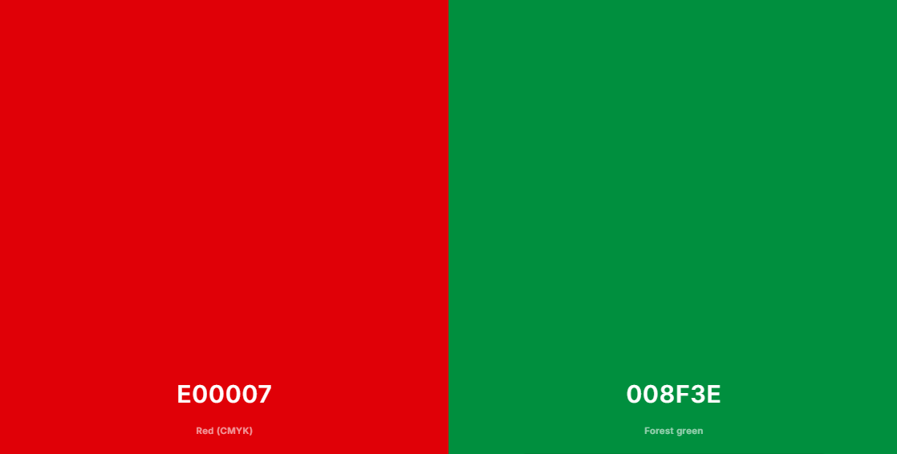
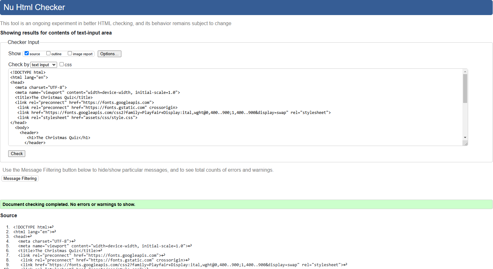
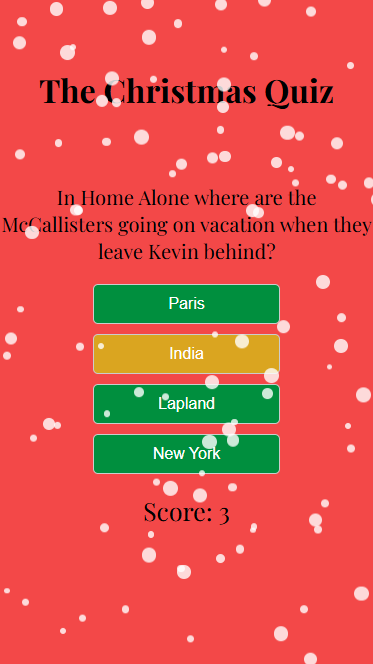

# The_Christmas_Quiz

## Description

[View the live project here.](https://louisesykes198.github.io/The_Christmas_Quiz/)

The Christmas Quiz Game is a fun, festive trivia experience that tests your Christmas knowledge. Players can enjoy Christmas-themed questions.

Each correct answer earns points and triggers fun animations from a festive mascot, while friendly feedback encourages players to keep going. 
The game features a scoreboard and a celebratory ending with snowfall and music.

Perfect for playing on your own or playing with friends, this game is a nice way to celebrate Christmas!

## User Experience (UX)

### User stories

User Story for a Christmas Quiz Game
A Christmas Quiz: 

This quiz is for users who love Christmas and enjoy trivia games.

I want to create a fun and engaging Christmas-themed quiz that tests my holiday knowledge while giving me a good festive experience.

you can Learn interesting facts, challenge yourself, and share the joy of Christmas with friends and family.

#### First Time Visitor Goals

To explore the Game.

1. Understand the concept and rules of the Christmas Quiz Game.

2. Get a feel for the festive theme and user-friendly design.

3. Start the game and answer up to 10 questions to experience the full game.

4. See the interactive elements like the score mascot animation moving up the board.

5. Appreciate the festive theme and Christmas questions.

6. Learn about multiplayer options or share results with friends and family.

6. Complete the questions or a full round and enjoy the celebratory experience.

#### Returning Visitor Goals

1. Aim to beat their previous high score or achieve a perfect game.

2. Share results and invite others to play.

#### Frequent User Goals

1. Complete all categories and achieve the highest possible score.
2. Challenge themselves with time limits.
3. Use the game as one of their new holiday traditions.

### Design

The design features a red background with a festive touch of falling snowflakes. The buttons are green colour, with a gold hover effect, 
providing an elegant contrast against the red background and adding a holiday feel to the quiz page.

#### Favicon
The favicon was designed and downloaded from [w3cub.com](https://tools.w3cub.com/favicon-converter)


#### Colour Scheme
The colour scheme for the quiz page is festive and colourful. The primary background is a rich red, which creates a warm and welcoming environment. 
The buttons are a vibrant, refreshing green that stands out against the red background. 
When users hover over the buttons, they change to gold, providing an air of beauty and warmth. 
The use of red, green, and gold suggests a Christmas or winter motif, making the design visually appealing and seasonal.



#### Typography
The typography enhances the festive design by being clear, bold, and modern. The quiz questions are written in an effective and easy-to-read font, 
such as Playfair Display or sans-serif, which makes them stand out on the page. The button language is straightforward and clear, so it's readable and complements the modern design.  
The text colours are largely black and white to contrast with the red background, with some tweaks to match the green and gold button styles.
All fonts were sourced through [Google Fonts](https://fonts.google.com/)
The font that I've selected for my website is simple, modern, and extremely readable; it's meant to communicate both professionalism and warmth. 
The headlines' bold, Playfair Display font draws attention without being unduly harsh, and nicely balanced. 


#### Layout

The quiz page's layout is simple and practical, intended to keep the user focused on the quiz information while retaining a festive theme:

1. The background: The entire page has a red backdrop with animated falling snowflakes, which creates a lively and appealing mood.
2. Question Section: The question is prominently displayed at the top centre of the page under the heading in a bold font making it the design's focus point.
3. The answer buttons appear beneath the question in a grid or single-column arrangement, depending on the screen size.
4. The buttons are evenly placed for clarity, with a bright green colour and a gold hover effect to emphasise interactivity.
   Responsive Design: The layout adapts to various screen sizes, making the quiz accessible on desktop, mobile and iPad devices.
   Elements modify spacing and position to ensure a clean appearance on smaller displays.
   
This layout is striking with a mix of utility and the festive theme, making the quiz visually appealing and easy to browse.

#### Imagery
The imagery on the quiz page contributes to its festive and entertaining theme:
Animated snowflakes gently fall across the screen, giving movement and a wintery atmosphere. The snowflakes are delicate and not distracting, 
creating a dynamic background without overpowering the content.
The bright red background shows warmth and festivity, making it the ideal canvas for the interactive features and adding to the festive mood.
Green buttons with a gold hover effect offer contrast while also creating a sense of interactivity, directing the user's attention to the quiz answers.
Overall, the picture uses movement (snowflakes), vivid colours, and modest decorative elements to create a welcoming and joyous mood.


### Wireframes

The wireframes I’ve created for my website serve as a visual reference for planning and organizing the overall layout of the site. 
The wireframes allow me to map out the layout of each page, focusing on how visitors will navigate and interact with the content.

Desktop Wireframe 


Mobile Wireframe 


Tablet and iPad Wireframe 


## Features

### Answer Buttons

The answer buttons in the quiz are meant to be interactive and visually engaging. They are in a festive green that complements the red background, providing a stunning contrast. When hovered over, the buttons take on a gold style, making them feel dynamic and interesting. Each button is clearly labeled with the available answers, ensuring they are easily readable. Their location is natural, with buttons simple to find on any screen, from desktop to mobile. These buttons improve the user experience by adding functionality and a festive feel to the quiz.


### Hover Effect
The gold hover feature gives an interactive and festive feel to the quiz page. When users hover over the green answer buttons, the background colour changes to gold, producing a beautiful and eye-catching impression. This feature not only improves the visual appeal, but it also gives users clear feedback, making the buttons feel more interesting. The transition is smooth and simple, complementing the Christmas theme while keeping a modern, user-friendly appearance.


### Snowfall 

Falling Snowflakes: Animated snowflakes gently fall across the screen, giving movement and a wintery atmosphere. The snowflakes are delicate and not distracting, creating a vibrant background without overpowering the content.


### Footer

The footer adds a professional and polished touch to the quiz page. It includes the following text:

"©2025 My Christmas Quiz. All rights reserved."

It is styled with white lettering to complement the festive tone and sits neatly at the bottom of the page. Its minimalist design guarantees that it does not detract from the main material while yet performing a useful purpose.


## Technologies Used

### Languages Used

[HTML5](https://en.wikipedia.org/wiki/HTML5)

[CSS3](https://en.wikipedia.org/wiki/Cascading_Style_Sheets)

[Javascript](https://simple.wikipedia.org/wiki/JavaScript)

### Frameworks, Libraries & Programs Used

1. [Bootstrap 4.4.1:](https://getbootstrap.com/docs/4.4/getting-started/introduction/)
    - Bootstrap was used to assist with the responsiveness and styling of the website.
2. [Hover.css:](https://ianlunn.github.io/Hover/)
    - Hover.css was used on the Social Media icons in the footer to add the float transition while being hovered over.
3. [Google Fonts:](https://fonts.google.com/)
    - Google fonts were used to import the 'Titillium Web' font into the style.css file which is used on all pages throughout the project.
4. [jQuery:](https://jquery.com/)
    - jQuery came with Bootstrap to make the navbar responsive but was also used for the smooth scroll function in JavaScript.
5. [Git](https://git-scm.com/)
    - Git was used for version control by utilizing the Gitpod terminal to commit to Git and Push to GitHub.
6. [GitHub:](https://github.com/)
    - GitHub is used to store the projects code after being pushed from Git.
7. [balsamiq:](https://balsamiq.cloud/sp5ubr/pf6h5dr/r5F4B))
    - balsamiq was used to create the [wireframes](https://github.com/) during the design process.

## Testing

The website is responsive on all device sizes.

### Desktop


### Mobile


### Ipad pro


The W3C Markup Validator and W3C CSS Validator Services were used to validate every page of the project to ensure there were no syntax errors in the project.

[W3C Markup Validator](https://jigsaw.w3.org/css-validator/#validate_by_input)



[W3C CSS Validator](https://jigsaw.w3.org/css-validator/#validate_by_input)


[JSHint js Validator](https://jshint.com/)


### Testing User Stories from user Experience (UX) Section
    
#### First Time Visitor Goals

#### Returning Visitor Goals

### Further Testing

The quiz page was tested on Google Chrome, Microsoft Edge and Safari browsers.
The quiz page was viewed on a variety of devices such as Desktop, Laptop, samsung galaxy A12, samsung galaxy s22 & iPhoneSE.
Friends and family members were asked to review the site and documentation to point out any bugs and/or user experience issues.

### Reviews

### Known Bugs

Hover button stays gold when it moves to the next question



Performance, Accessibility, Best Practice and SEO checked on.

#### Mobile Performance 


#### Desktop Performance 


#### Deployment

### GitHub Pages

The project was deployed to GitHub Pages using the following steps...

1. Log in to GitHub and locate the [GitHub Repository](https://github.com/)
2. At the top of the Repository (not top of page), locate the "Settings" Button on the menu.
    
3. Alternatively Click [Here](https://github.com/louisesykes198/My_crochet_page) for a GIF demonstrating the process starting from Step 2.
3. Scroll down the Settings page until you locate the "GitHub Pages" Section.
4. Under "Source", click the dropdown called "None" and select "Main Branch".
5. The page will automatically refresh.
6. Scroll back down through the page to locate the now published site [link](https://github.com) in the "GitHub Pages" section.

### Forking the GitHub Repository

By forking the GitHub Repository we make a copy of the original repository on our GitHub account to view and/or make changes without affecting the original repository by using the following steps...

1. Log in to GitHub and locate the [GitHub Repository](https://github.com/)
2. At the top of the Repository (not top of page) just above the "Settings" Button on the menu, locate the "Fork" Button.
3. You should now have a copy of the original repository in your GitHub account.

### Making a Local Clone

1. Log in to GitHub and locate the [GitHub Repository](https://github.com/)
2. Under the repository name, click "Clone or download".
3. To clone the repository using HTTPS, under "Clone with HTTPS", copy the link.
4. Open Git Bash
5. Change the current working directory to the location where you want the cloned directory to be made.
6. Type `git clone`, and then paste the URL you copied in Step 3.

```
$ git clone https://github.com/YOUR-USERNAME/YOUR-REPOSITORY
```

7. Press Enter. Your local clone will be created.

```
$ git clone https://github.com/YOUR-USERNAME/YOUR-REPOSITORY
> Cloning into `CI-Clone`...
> remote: Counting objects: 10, done.
> remote: Compressing objects: 100% (8/8), done.
> remove: Total 10 (delta 1), reused 10 (delta 1)
> Unpacking objects: 100% (10/10), done.
```

Click [Here](https://help.github.com/en/github/creating-cloning-and-archiving-repositories/cloning-a-repository#cloning-a-repository-to-github-desktop) to retrieve pictures for some of the buttons and more detailed explanations of the above process.

## Credits

### Code

The full-screen background image code came from this [freepik](https://freepik.com)

[Bootstrap5](https://getbootstrap.com/docs/5.3.3/getting-started/introduction/): Bootstrap Library used throughout the project mainly to make site responsive using the Bootstrap Grid System.

### Content

All content was written by the developer.

### Media

All Images were created by the [fontawesome](https://fontawesome.com/)

### Acknowledgements

Tutor support at Code Institute for their support.

Family and Friends for feedback
